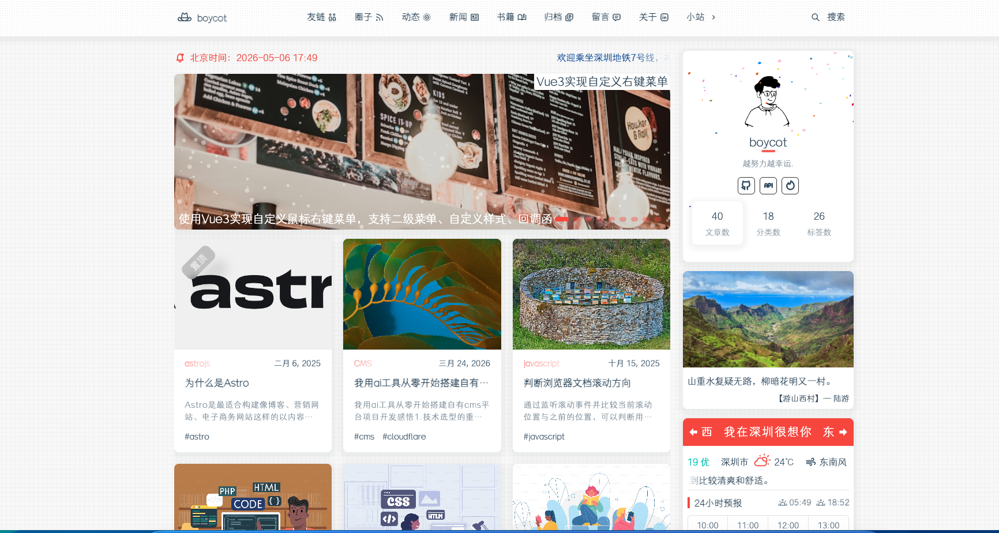
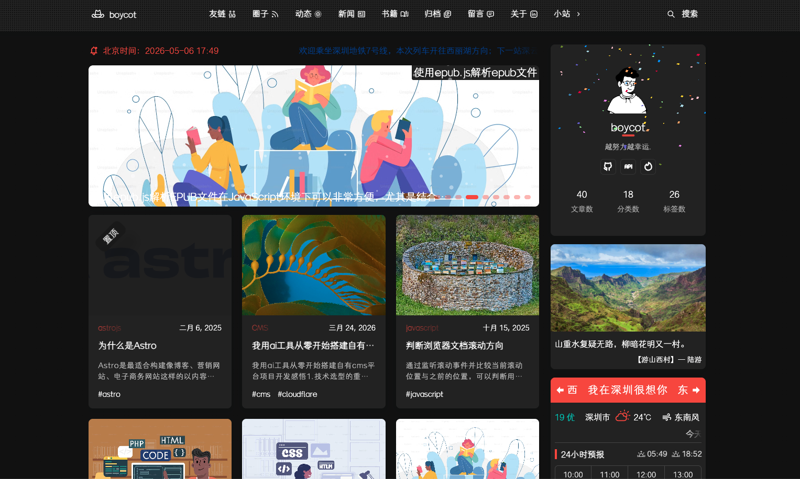

# Astro Blog

一个基于 Astro 构建的现代化博客主题，具有优雅的设计、丰富的功能和良好的用户体验。

## 🌟 特性

- **现代化架构**: 基于 Astro 5.x + TailwindCSS 4.x 构建
- **平滑页面过渡**: 集成 Swup 实现流畅的页面切换动画
- **响应式设计**: 完美适配桌面端和移动端
- **双主题支持**: 支持亮色/暗色主题切换
- **博客功能**: 支持 Markdown/MDX 文章、分类、标签、归档
- **评论系统**: 集成 Waline 评论系统
- **全文搜索**: 使用 Pagefind 实现静态搜索
- **音乐播放器**: 集成 APlayer 音乐播放器
- **电子书阅读**: 支持 EPUB 格式电子书在线阅读
- **文章点赞**: 支持文章点赞功能
- **图片懒加载**: 优化页面加载性能
- **代码高亮**: 支持多种代码主题

## 📱 预览

### 亮色主题


### 暗色主题


## 🔧 快速开始

### 环境要求

- **Node.js**: >= 18.0.0
- **pnpm**: 推荐使用 pnpm 作为包管理器

### 安装依赖

```bash
# 使用 pnpm 安装（推荐）
pnpm install

# 或使用 npm
npm install
```

### 开发模式

```bash
# 启动开发服务器
pnpm dev

# GitHub Pages 开发模式
pnpm dev:github
```

### 构建生产版本

```bash
# 构建生产版本
pnpm build

# GitHub Pages 构建
pnpm build:github
```

### 预览构建结果

```bash
pnpm preview
```

## 📁 项目结构

```
.
├── public/                    # 静态资源目录
│   ├── assets/               # 静态资源（CSS、JS、图片、字体）
│   ├── avatar.svg            # 头像
│   └── favicon.svg           # 网站图标
├── script/                   # 脚本工具
│   └── newpost.js            # 新建文章脚本
├── src/                      # 源代码目录
│   ├── api/                  # API 接口
│   ├── components/           # 组件目录
│   │   ├── Archive/          # 归档组件
│   │   ├── ArticleCard/      # 文章卡片组件
│   │   ├── Comment/          # 评论组件
│   │   ├── Search/           # 搜索组件
│   │   └── ...
│   ├── content/              # 内容目录
│   │   ├── blog/             # 博客文章
│   │   └── ebook/            # 电子书
│   ├── data/                 # 数据文件
│   ├── layouts/              # 布局组件
│   ├── pages/                # 页面路由
│   ├── plugins/              # 自定义插件
│   ├── scripts/              # 前端脚本
│   ├── styles/               # 全局样式
│   ├── config.ts             # 网站配置
│   └── content.config.ts     # 内容配置
├── astro.config.mjs          # Astro 配置
├── package.json              # 项目依赖
└── README.md                 # 项目说明
```

## ⚙️ 配置说明

### 网站配置

修改 `src/config.ts` 文件来自定义网站信息：

```typescript
export default {
  Site: 'https://your-domain.com',
  Title: '你的博客标题',
  Subtitle: '博客副标题',
  Author: '作者名',
  Email: 'your@email.com',
  // ... 更多配置
}
```

### 新建文章

使用脚本快速创建新文章：

```bash
pnpm newpost
```

### 评论系统

项目集成了 Waline 评论系统。在使用前需要配置 LeanCloud：

1. 注册 LeanCloud 账号并创建应用
2. 在 `src/config.ts` 中配置 `WALINE_SERVER_URL` 和 `WALINE_APP_KEY`

## 📖 页面功能

| 页面 | 路径 | 说明 |
|------|------|------|
| 首页 | `/` | 博客文章列表 |
| 关于 | `/about/` | 个人介绍 |
| 归档 | `/archives/` | 文章归档 |
| 分类 | `/categories/` | 文章分类 |
| 标签 | `/tag/` | 文章标签 |
| 留言板 | `/message/` | 留言功能 |
| 友链 | `/friends/` | 友情链接 |
| 电子书 | `/eBook/` | EPUB 阅读器 |
| 地铁图 | `/subway/` | 地铁线路图 |

## 🚀 部署

### Vercel 部署

[](https://vercel.com/new/clone?repository-url=https://github.com/boycot2015/astro-blog)

### Netlify 部署

[](https://app.netlify.com/start/deploy)

### GitHub Pages 部署

```bash
# 部署到 GitHub Pages
pnpm deploy
```

## 📝 脚本命令

| 命令 | 说明 |
|------|------|
| `pnpm dev` | 启动开发服务器 |
| `pnpm dev:github` | GitHub Pages 开发模式 |
| `pnpm build` | 构建生产版本 |
| `pnpm build:github` | GitHub Pages 构建 |
| `pnpm preview` | 预览构建结果 |
| `pnpm newpost` | 创建新文章 |
| `pnpm offdev` | 禁用开发工具栏 |
| `pnpm ondev` | 启用开发工具栏 |
| `pnpm deploy` | 部署到 GitHub Pages |

## 🛠️ 技术栈

- **框架**: Astro 5.x
- **样式**: TailwindCSS 4.x
- **图标**: SVG
- **评论**: Waline
- **播放器**: APlayer
- **图表**: ECharts
- **电子书**: EPUB.js
- **动画**: Swup
- **代码高亮**: Shiki

## 📄 许可证

MIT License

## 🤝 贡献

欢迎提交 Issue 和 Pull Request！

## 📧 联系

如有问题或建议，欢迎通过以下方式联系：

- 邮箱: boycot2017@163.com
- GitHub: [@boycot2015](https://github.com/boycot2015)

---

⭐ 如果这个项目对你有帮助，请给个 Star！